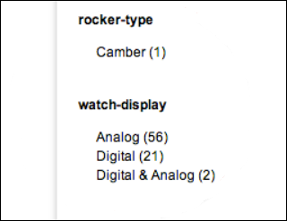

# 关于动态彩块化{#about-dynamic-facets}

使用动态彩块化在搜索时自动创建新的范围选择。 您可以选择在AdobeSearch&amp;Promote帐户中将每个动态facet字段与最多一个表名关联。 您可以在搜索时对搜索中涉及的任何动态facet字段应用这些表关系。

## 使用动态彩块化{#concept_E65A70C9C2E04804BF24FBE1B3CAD899}

>[!NOTE]
>
>默认情况下，[!DNL Adobe Search&Promote]中未启用此功能。 请与技术支持联系以激活该功能供您使用。

如果不使用动态彩块化，您必须将相关属性合并到“插槽”中，并且只显示相同的插槽，以便进行给定搜索。 即，它们只能包含一个逻辑属性的值，如“鞋大小”或“圈大小”。 该方法通过大量的唯一属性提供了足够的搜索时间性能。

但是，在使用动态分页时，它不会对核心搜索可以有效跟踪的彩块化数量设置限制。 您可以定义数百个动态彩块化，核心搜索可以从中返回给定搜索的“顶部`N`动态彩块化”，其中`N`通常是10-20或更小的值。 此方法无需插入属性——您现在可以为网站中的属性创建唯一的动态facet。

## 您应将哪些方面变为动态？{#section_254EE034BCAD4250A5D09FBF6158C4A5}

在您的网站中稀疏填充且仅显示为部分搜索的彩块化是实现动态的最佳候选。 例如，仅在搜索鞋或靴时，才能填充名为“forefoot width”的小平面。 而另一个名为“脸数字样式”的彩块，其可能值为“罗马”和“阿拉伯语”，则只有在搜索手表或时钟时才会出现。

如果您的帐户有大量此类facet，它会增强搜索性能以使用动态facet，而不是始终为每次搜索选择整组可能facet。 通常适用于显示每个搜索结果的通用彩块化（如“SKU”或“品牌”）通常不适用于动态彩块化。

## facet与元标记字段{#section_2869E5FCDA8B431A87BC6E5573F2B0A0}的关系

彩块化构建在元标记字段的顶部。 元标记字段是[!DNL Adobe Search&Promote]的低级核心搜索层功能。 彩块化，另一方面是GS（向导搜索）的一部分-AdobeSearch&amp;Promote的高级表示层。 但是，Facet自有的meta标签字段对facet一无所知。 配置动态彩块化时，您首先添加彩块化，然后在选择动态彩块化选项的情况下添加元标签字段，以将标识彩块化设置为动态彩块化。

>[!NOTE]
>
>**[!UICONTROL Design > Navigation > Facets]**&#x200B;中没有“动态彩块化”设置。 facet的“dynamic”是其基础“meta tag field”是动态的，如&#x200B;**[!UICONTROL Settings > Metadata > Definitions]**&#x200B;中所设置。

## {#section_BC699A05E2E742EF94D41679163ACE84}中的动态彩块化示例

搜索“引导”后显示的动态彩块化示例：


搜索“监视”后显示的动态彩块化的另一个示例：



另请参阅

* [后端搜索CGI参数](../c-appendices/c-cgiparameters.md#reference_582E85C3886740C98FE88CA9DF7918E8)
* [演示文稿模板标记](../c-appendices/c-templates.md#reference_F1BBF616BCEC4AD7B2548ECD3CA74C64)
* [传输模板标记](../c-appendices/c-templates.md#reference_227D199F5A7248049BE1D405C0584751)

## 配置动态彩块化{#task_D17F484130E448258100BAC1EEC53F39}

在Search&amp;Promote中设置动态彩块化。

<!-- 

t_configuring_dynamic_facets.xml

 -->

>[!NOTE]
>
>默认情况下，AdobeSearch&amp;Promote中未启用此功能。 请与技术支持联系以激活该功能供您使用。

在您的动态彩块化效果对客户可见之前，您必须重新构建您的站点索引。

另请参阅

* [后端搜索CGI参数](../c-appendices/c-cgiparameters.md#reference_582E85C3886740C98FE88CA9DF7918E8)
* [演示文稿模板标记](../c-appendices/c-templates.md#reference_F1BBF616BCEC4AD7B2548ECD3CA74C64)
* [传输模板标记](../c-appendices/c-templates.md#reference_227D199F5A7248049BE1D405C0584751)

**配置动态彩块化**

1. 确保您已添加彩块化。

   请参阅[添加新facet](../c-about-design-menu/c-about-facets.md#task_FC07BFFA62CA4B718D6CBF4F2855C89B)。
1. 添加彩块化后，请确保您已将彩块化添加到新的用户定义的元标记字段。

   请参阅[添加新的元标记字段](../c-about-settings-menu/c-about-metadata-menu.md#task_6DF188C0FC7F4831A4444CA9AFA615E5)。
1. 在产品菜单上，单击&#x200B;**[!UICONTROL Settings]** > **[!UICONTROL Metadata]** > **[!UICONTROL Definitions.]**
1. 在[!DNL Definitions]页面的[!DNL User-defined fields]表的[!DNL Actions]列中，单击与要动态化的facet关联的meta标记字段名称行中的铅笔图标（编辑）。
1. 在[!DNL Edit Field]页面上，检查&#x200B;**[!UICONTROL Dynamic Facet]**。

   请参阅[添加新元标记字段](../c-about-settings-menu/c-about-metadata-menu.md#task_6DF188C0FC7F4831A4444CA9AFA615E5)中的选项表。
1. 单击 **[!UICONTROL Save Changes]**.
1. 单击蓝色框中的&#x200B;**重新生成分阶段站点索引**&#x200B;以快速重建分阶段网站索引。

   另请参阅[重新生成实时或分阶段网站的索引](../c-about-index-menu/c-about-regenerate-index.md#task_B28DE40C0E9A475ABCBCBC4FF993AACD)。
1. 确定要为给定搜索选择的动态彩块化数。 您可以通过执行以下任一操作来完成此任务:

   * 创建具有任何所需条件的查询清理规则，执行`set`、`backend parameter`、`sp_sfvl_df_count`到值`X`的操作，其中`X`是搜索时要请求的所需数量的动态彩块化，然后单击&#x200B;**[!UICONTROL Add]**。

   

   请参阅[添加查询清理规则](../c-about-rules-menu/c-about-query-cleaning-rules.md#task_47F43988D3D9485F8AE1DFDA7E00BF54)。

   另请参见表中的[后端搜索CGI参数](../c-appendices/c-cgiparameters.md#reference_582E85C3886740C98FE88CA9DF7918E8)行40，进一步说明`sp_sfvl_df_count`。

   * 添加搜索并将“custom” `sp_sfvl_df_count`参数设置为所需值，然后单击&#x200B;**[!UICONTROL Add]**。

   

   请参阅[添加新搜索定义](../c-about-settings-menu/c-about-searching-menu.md#task_98D3A168AB5D4F30A1ADB6E0D48AB648)。

   另请参见表中的[后端搜索CGI参数](../c-appendices/c-cgiparameters.md#reference_582E85C3886740C98FE88CA9DF7918E8)行40，进一步说明`sp_sfvl_df_count`。

1. 编辑相应的传输模板以输出核心搜索返回的动态彩块化。

   请参阅[编辑演示文稿或传输模板](../c-about-design-menu/c-about-templates.md#task_800E0E2265C34C028C92FEB5A1243EC3)。

   例如，假定传输模板的名称为`guided.tpl`。 在这种情况下，在产品菜单上，单击&#x200B;**[!UICONTROL Design > Templates]**。 在[!DNL Templates]页面上，找到表中的`guided.tpl`。 然后单击名称最右侧的&#x200B;**[!UICONTROL Edit]**。 在“编辑”页面上，将以下代码块添加到`</facets>`的末尾：JSON输出：

   ```
   ... 
   }<search-dynamic-facet-fields>, 
           { 
               "name" : "<search-dynamic-facet-field-name>", 
               "dynamic-facet" : 1, 
               "values" : [<search-field-value-list quotes="yes" commas="yes" data="values" sortby="values" encoding="json" />], 
               "counts" : [<search-field-value-list quotes="yes" commas="yes" data="results" sortby="values" />] 
   
           }</search-dynamic-facet-fields> 
   ...
   ```

1. 编辑相应的演示文稿模板或模板以输出动态彩块化。

   请参阅[编辑演示文稿或传输模板](../c-about-design-menu/c-about-templates.md#task_800E0E2265C34C028C92FEB5A1243EC3)。

   例如，假定您有一个名为`sim.tmpl`的模板，用于输出模拟器中的内容。 要编辑该模板，请在产品菜单上单击&#x200B;**[!UICONTROL Design > Templates]**。 在[!DNL Templates]页面上，找到表中的`sim.tmpl`。 然后单击名称最右侧的&#x200B;**[!UICONTROL Edit]**。 在“编辑”页面上，在模板的facet显示区域中添加以下内容：

   ```
   <h6>DF RAIL</h6> 
   <guided-facet-rail gsname="__dynamic_facets"> 
               <guided-facet ><!-- behavior=Normal --> 
               <div class="facet-block" id="facet"> 
               <p><b><guided-facet-display-name /></b></p> 
               <ul> 
                   <guided-facet-values> 
                       <guided-if-facet-value-equals-length-threshold> 
               </ul> 
               <ul id="brand" style="display:none"> 
                       </guided-if-facet-value-equals-length-threshold> 
                       <guided-if-facet-value-selected> 
                           <li><guided-facet-value> [<guided-lt>a href="<guided-facet-value-undo-path />"<guided-gt>X</a>]</li> 
                       <guided-else-facet-value-selected> 
                           <li><guided-facet-link><guided-facet-value></guided-facet-link> (<guided-facet-count>) </li> 
                       </guided-if-facet-value-selected> 
                   </guided-facet-values> 
               </ul> 
               <guided-if-facet-long> 
                 <br /><guided-lt />a href="#" onclick="moreless(this,'brand');return false;" <guided-gt /><button style="font-size:10px;">VIEW MORE</button></a> 
               </guided-if-facet-long> 
               </div> 
               </guided-facet> 
   </guided-facet-rail> 
   <h6>/DF RAIL</h6>
   ```

   您还可以根据需要对其他演示文稿模板进行类似修改，如`json.tmpl`。

   请确保在`guided-facet-rail`标记中为`gsname`指定`__dynamic_facets`。 此标记是预定义的facet边栏，保留用于输出为给定搜索返回的任何动态facet。

   您还可以选择通过&#x200B;**[!UICONTROL Rules > Business Rules]**&#x200B;和使用&#x200B;**[!UICONTROL Advanced Rule Builder]**&#x200B;编辑此特殊的facet边栏，如下所示。

   

   另请参阅[添加新业务规则](../c-about-rules-menu/c-about-business-rules.md#task_BD3B31ED48BB4B1B8F1DCD3BFA2528E7)
